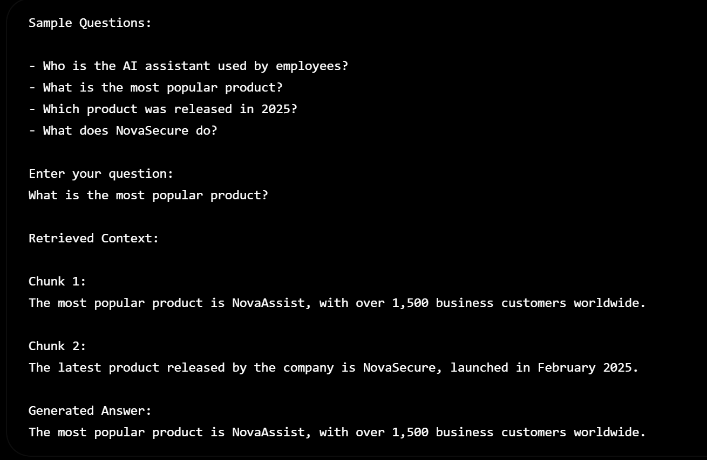

# Grounded LLM with Retrieval-Augmented Generation (RAG)

## Overview

This project implements a Retrieval-Augmented Generation (RAG) pipeline from scratch to understand how modern NLP systems combine semantic search with Large Language Models (LLMs).

Instead of relying solely on an LLM's internal knowledge, the system retrieves the most relevant information from external documents and uses that context to generate grounded, context-aware responses.

The project demonstrates the complete RAG workflow, including document loading, text chunking, embedding generation, vector indexing, semantic retrieval, and answer generation using a local Ollama model.


## Architecture

The system follows the standard Retrieval-Augmented Generation pipeline:

```text
Documents (TXT)
      │
      ▼
Document Loader
      │
      ▼
Text Chunking
      │
      ▼
Sentence Embeddings
      │
      ▼
FAISS Vector Index
      │
      ▼
User Query
      │
      ▼
Query Embedding
      │
      ▼
Top-K Semantic Retrieval
      │
      ▼
Retrieved Context
      │
      ▼
Local LLM (Ollama)
      │
      ▼
Grounded Response
```

## Project Structure

```text
Grounded-LLM-RAG/
│
├── documents/                 # Sample documents
├── src/
│   ├── loader.py
│   ├── chunker.py
│   ├── embedder.py
│   └── generator.py
│
├── config.py
├── main.py
├── requirements.txt
└── README.md
```

## Components

### Document Loader

Loads text documents from the data directory while preserving document metadata.

### Chunker

Splits documents into overlapping chunks to improve retrieval quality and maintain semantic context.

### Embedder

Generates dense semantic embeddings using the **all-MiniLM-L6-v2** sentence-transformer model.

### Vector Store

Stores document embeddings in a **FAISS** index for efficient similarity search.

### Retriever

Converts the user query into an embedding and retrieves the most relevant document chunks.

### Generator

Uses a local **Ollama** model to generate answers grounded in the retrieved context.

## Embedding Strategy

Each document chunk is converted into a 384-dimensional dense vector using the **all-MiniLM-L6-v2** embedding model. The system performs retrieval at the chunk level rather than the document level, allowing more precise semantic matching between user queries and relevant information.

## Technologies Used

- Python
- Sentence Transformers
- FAISS
- NumPy
- Ollama
- Local Large Language Models (LLMs)

## How to Run

Install the required dependencies:

```bash
pip install -r requirements.txt
```

Run the project:

```bash
python main.py
```

Enter your question when prompted.

---

## Sample Questions

The repository contains fictional documents for testing the retrieval pipeline.

Try asking:

- Who is the AI assistant used by employees?
- What is the most popular product?
- Which product was released in 2025?
- What does NovaSecure do?
- Which department follows Agile development?
- How many annual leave days do employees receive?
- What is NovaMind Enterprise?

## Demo



## Learning Objectives

This project was built to gain hands-on understanding of the core concepts behind Retrieval-Augmented Generation, including:

- Document preprocessing
- Text chunking
- Semantic embeddings
- Vector similarity search
- FAISS indexing
- Context retrieval
- Grounded response generation
- Local LLM inference with Ollama

